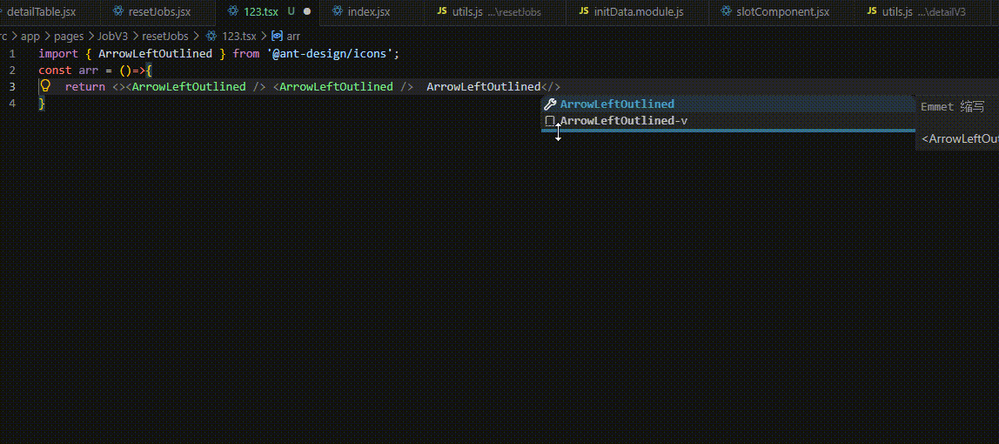

# Auto Ant Icon Helper


Automatically generate Ant Design icon components and import statements while typing.

🚀 Automatically generate Ant Design icon components and import statements while typing.

---

## ✨ Features

### ✅ Auto Generate Icon Component

Type

```text
ArrowDownOutline-v
```

Automatically becomes

```tsx
<ArrowDownOutline />
```

---

### ✅ Auto Import

Automatically inserts

```tsx
import { ArrowDownOutline } from '@ant-design/icons';
```

If the import already exists, only the missing icon will be added.

---

### ✅ No Duplicate Imports

Already imported icons won't be added again.

---

### ✅ Works With

- React
- TypeScript
- JavaScript
- TSX
- JSX

---

# 🎬 Demo

> Replace the image below with your own GIF.



---

# 📷 Screenshot


---

# 🚀 Usage

## Step 1

Type

```text
ArrowDownOutline-v
```

---

## Step 2

The extension automatically converts it into

```tsx
<ArrowDownOutline />
```

---

## Step 3

Automatically inserts

```tsx
import { ArrowDownOutline } from '@ant-design/icons';
```

---

# 💻 Example

### Before

```tsx
const App = () => {
  return (
    <div>
      ArrowDownOutline-v
    </div>
  );
};

export default App;
```

---

### After

```tsx
import { ArrowDownOutline } from '@ant-design/icons';

const App = () => {
  return (
    <div>
      <ArrowDownOutline />
    </div>
  );
};

export default App;
```

---

# ⚡ Features

- ✅ Auto replace `IconName-v`
- ✅ Auto import icons
- ✅ Prevent duplicate imports
- ✅ Create import if it doesn't exist
- ✅ Support existing import statements
- ✅ Lightweight
- ✅ No configuration required

---

# 📦 Installation

1. Open VS Code

2. Open Extensions

3. Search

```
Auto Ant Icon Helper
```

4. Click Install

---

# 📂 Supported Import

```tsx
import { ArrowDownOutline } from '@ant-design/icons';
```

If there is no import statement, the extension will automatically create one.

---

# ❤️ Why Use This Extension

Without this extension

```text
Copy icon name

↓

Paste component

↓

Find import

↓

Add import manually
```

With this extension

```text
Type

ArrowDownOutline-v

↓

Done ✅
```

---

# 📝 Release Notes

## 1.0.0

- Initial release
- Auto generate Ant Design icon components
- Auto import icons
- Prevent duplicate imports

---

# 📄 License

MIT

---

## ⭐ If you like this extension

Please consider giving the project a ⭐ on GitHub.

Happy Coding! 🚀